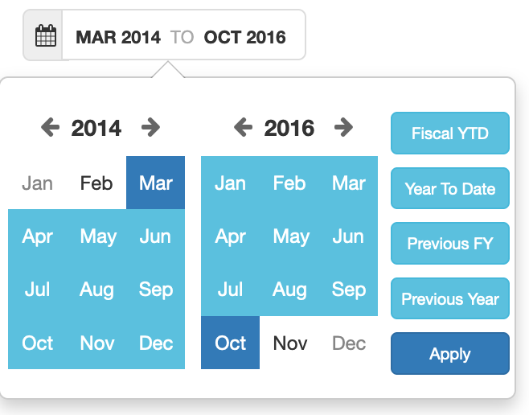

# Responsive Boostrap based month range picker

## Context
* The [dangrossman/bootstrap-daterangepicker](https://github.com/dangrossman/bootstrap-daterangepicker) didn't provide a month range picker so we decided to initiate our own.
* Rklachko has tried to fork the above project [here](https://github.com/rklachko/bootstrap-daterangepicker/tree/month-view) with month view only, but it is unmaintained and has conflict with [dangrossman/bootstrap-daterangepicker](https://github.com/dangrossman/bootstrap-daterangepicker) if you use it.
* There is already a suggested idea [here](https://codepen.io/nathanfiscus/pen/qELYjG) by Nathan Fiscus, but in some context, we need it with more flexible options.
* Another existing component is proposed [here](http://yaireo.github.io/dateRangePicker/) by yairEO, but it is not responsive (Tether js issue we think).
## Solution
Propose light solution: 
* which has no conflict with **dangrossman/bootstrap-daterangepicker**,
* which is responsive
* more flexible

## Overview


## Usage
```javascript
<script>
    $("#test").responsiveMonthRange({
        onApply: function (data) {
            console.log(JSON.stringify(data));
        }
    });
    $("#test2").responsiveMonthRange({
        button:{
            fiscalYtd: {show:false}
        },
        onApply: function (data) {
            console.log("yes");
        }
    });
    $("#test3").responsiveMonthRange({
        button:{
            fiscalYtd: {show:false},
            previousFY: {show:false}
        },
        onApply: function (data) {
            console.log("blabla");
        }
    });
</script>
```

# Contribute?
## How to
* Write plugin : https://learn.jquery.com/plugins/basic-plugin-creation/

## TODO
1. adapt to fluid responsiveness, eg: https://www.stephanboyer.com/post/41/fluid-and-responsive-grid-layouts-in-css
1. add cancel action (button + when clicking outside)
